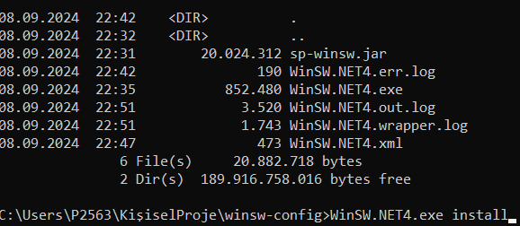
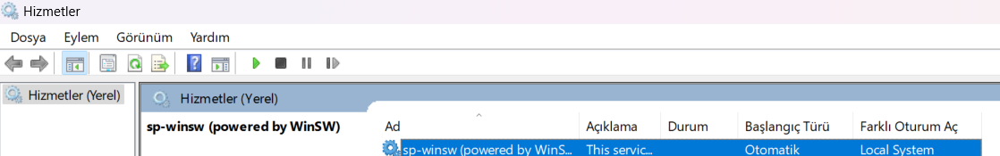

# Spring Boot Uygulamasını WinSW ile Windows Servisi Olarak Çalıştırma

Bu proje, Spring Boot uygulamasını WinSW (Windows Service Wrapper) kullanarak Windows servisi olarak çalıştırmayı göstermektedir.

### Gereksinimler

- Java
- Maven
- Spring Boot
- WinSW (Windows Service Wrapper)
- Windows işletim sistemi

### Adımlar

#### 1. Projeyi Derleyin

Spring Boot uygulamanızın ```pom.xml``` dosyasını aşağıdaki şekilde düzenleyin. Bu, uygulamanızı bir JAR dosyası olarak paketlemenizi sağlar.
```xml
<build>
    <finalName>sp-winsw</finalName>
    <plugins>
        <plugin>
            <groupId>org.springframework.boot</groupId>
            <artifactId>spring-boot-maven-plugin</artifactId>
            <configuration>
                <executable>true</executable>
            </configuration>
        </plugin>
    </plugins>
</build>
```
Maven ile projeyi derleyip JAR dosyasını oluşturun:

```bash
mvn clean install
```
Bu komut, ``` target/sp-winsw.jar``` dosyasını oluşturacaktır.

#### 2. WinSW Yapılandırmasını Oluşturun

WinSW yapılandırma dosyasını (WinSW.NET4.xml) aşağıdaki gibi oluşturun:

```xml
<service>
    <!-- Servis ID'si -->
    <id>burhan</id>

    <!-- Servisin Windows üzerinde görülecek ismi -->
    <name>sp-winsw (powered by WinSW)</name>

    <!-- Servis açıklaması -->
    <description>This service is created from a minimal configuration</description>

    <!-- Çalıştırılacak uygulama (Java) -->
    <executable>java</executable>

    <!-- Java komutu ile çalıştırılacak JAR dosyası -->
    <arguments>-jar sp-winsw.jar</arguments>
    
</service>
```

Bu dosyayı, Spring Boot JAR dosyanız (sp-winsw.jar) ve WinSW executable dosyası (WinSW.exe) ile aynı klasöre koyun.

#### 3. WinSW Kurulumu ve Servisin Başlatılması
<b>   WinSW Kurulumu: </b>
   WinSW'yi aşağıdaki github sayfasından indirip projeye dahil edin. İndirdikten sonra aşağıdaki dosyalar dizinde bulunmalıdır:

[WinSW GitHub](https://github.com/winsw/winsw)

```WinSW.exe``` <br>
```WinSW.NET4.xml``` (yukarıda oluşturduğunuz dosya) <br>
```sp-winsw.jar``` (oluşturduğunuz JAR dosyası) <br>

<b>Servisi Yükleme: </b>
Komut istemcisini yönetici olarak açın ve WinSW'nin bulunduğu klasöre gidin. Ardından aşağıdaki komutu çalıştırarak servisi kaydedin:

```bash
WinSW.exe install
```


#### 4. Servis Durumunu Kontrol Etme
   Windows Hizmet Yöneticisi'ni (services.msc) açarak servisin durumu hakkında bilgi alabilirsiniz. Burada servisinizin sp-winsw (powered by WinSW) ismiyle çalıştığını görmelisiniz.
